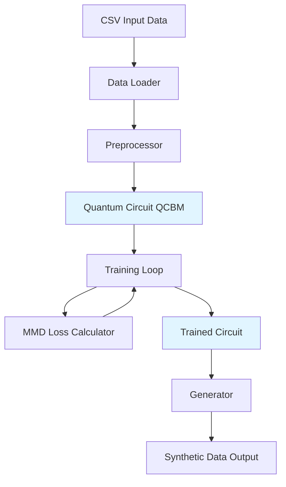

# Design Document: Vault-Synth Quantum Privacy Engine

## Overview

Vault-Synth is a Quantum Circuit Born Machine (QCBM) implementation that generates privacy-preserving synthetic financial data. The system uses quantum computing principles to learn the probability distribution of sensitive credit card transaction data and generates statistically similar synthetic samples that contain no real customer information.

The architecture follows a three-stage pipeline:
1. **Data Preprocessing**: Load, normalize, and discretize financial transaction data
2. **Quantum Training**: Train a parameterized quantum circuit to learn the data distribution using MMD loss
3. **Synthetic Generation**: Sample from the trained quantum circuit to produce synthetic data

The system is designed to run on classical simulators with laptop-grade hardware (16GB RAM), making it accessible without requiring actual quantum computers.

## Architecture

### High-Level Architecture



### Component Architecture

The system consists of five main components:

1. **Data Pipeline**
   - `DataLoader`: Reads CSV files and validates input
   - `Preprocessor`: Normalizes and discretizes data
   - `DataValidator`: Ensures data quality and format

2. **Quantum Circuit Layer**
   - `QCBMCircuit`: Defines the quantum circuit architecture
   - `QuantumDevice`: Manages PennyLane device initialization
   - `CircuitExecutor`: Runs quantum circuits and retrieves probabilities

3. **Training Engine**
   - `MMDLoss`: Computes Maximum Mean Discrepancy loss
   - `AdamOptimizer`: Manages parameter optimization
   - `TrainingLoop`: Orchestrates the training process

4. **Generation Engine**
   - `SyntheticGenerator`: Samples from trained circuit
   - `Postprocessor`: Converts bins back to continuous values
   - `OutputFormatter`: Formats synthetic data for export

5. **Configuration Manager**
   - `ConfigValidator`: Validates user-provided parameters
   - `HardwareProfiler`: Checks hardware constraints

## Components and Interfaces

### 1. Data Loader Module

**Purpose**: Load and validate CSV input data

**Interface**:
```python
class DataLoader:
    def load_csv(file_path: str) -> pd.DataFrame
    def validate_data(df: pd.DataFrame) -> bool
    def select_columns(df: pd.DataFrame, n_columns: int = 6) -> pd.DataFrame
```

**Key Responsibilities**:
- Read CSV files using pandas
- Validate file existence and format
- Select numerical columns for processing
- Handle missing values and data quality issues

**Error Handling**:
- Raise `FileNotFoundError` if CSV doesn't exist
- Raise `ValueError` if data contains invalid values (NaN, infinity)
- Raise `ValueError` if insufficient numerical columns available

### 2. Preprocessor Module

**Purpose**: Transform raw data into quantum-compatible format

**Interface**:
```python
class Preprocessor:
    def __init__(self, n_bins: int = 16)
    def normalize_to_pi(data: np.ndarray) -> np.ndarray
    def discretize(data: np.ndarray) -> np.ndarray
    def inverse_transform(bins: np.ndarray) -> np.ndarray
```

**Key Responsibilities**:
- Normalize values from original range to [0, π]
- Discretize continuous values into bins (default 16 bins)
- Store transformation parameters for inverse operation
- Handle edge cases (min == max, outliers)

**Normalization Formula**:
```
normalized_value = (value - min_value) / (max_value - min_value) * π
```

**Discretization**:
- Use equal-width binning strategy
- Store bin edges for inverse transformation
- Map continuous values to bin indices

### 3. Quantum Circuit (QCBM) Module

**Purpose**: Define and execute the quantum circuit that learns data distribution

**Interface**:
```python
class QCBMCircuit:
    def __init__(self, n_qubits: int, n_layers: int = 3)
    def build_circuit(weights: np.ndarray) -> qml.QNode
    def get_probabilities(weights: np.ndarray) -> np.ndarray
    def sample(weights: np.ndarray, n_shots: int) -> np.ndarray
```

**Architecture Details**:

**Device Configuration**:
```python
dev = qml.device('default.qubit', wires=n_qubits)
```

**Circuit Structure**:
1. **Initialization**: Apply Hadamard gates to all qubits (uniform superposition)
2. **Parameterized Layers**: Apply StronglyEntanglingLayers with 3 layers
3. **Measurement**: Return probability distribution using `qml.probs()`

**StronglyEntanglingLayers**:
- Each layer contains single-qubit rotations (RX, RY, RZ) followed by CNOT entangling gates
- Creates strong entanglement between all qubits
- Total parameters: `n_qubits * n_layers * 3` (3 rotation angles per qubit per layer)

**Circuit Diagram** (4 qubits, 1 layer example):
```
q0: ─H─Rot(θ₀)─╭●─────────────────
q1: ─H─Rot(θ₁)─╰X─╭●──────────────
q2: ─H─Rot(θ₂)────╰X─╭●───────────
q3: ─H─Rot(θ₃)───────╰X─Probs─────
```

**Key Responsibilities**:
- Initialize PennyLane device with specified qubits
- Build parameterized quantum circuit
- Execute circuit and return probability distributions
- Sample from probability distribution for generation

### 4. MMD Loss Module

**Purpose**: Compute statistical distance between real and generated distributions

**Interface**:
```python
class MMDLoss:
    def __init__(self, kernel_bandwidth: float = 1.0)
    def compute_kernel(x: np.ndarray, y: np.ndarray) -> float
    def calculate_mmd(real_data: np.ndarray, generated_data: np.ndarray) -> float
```

**MMD Formula**:
```
MMD²(P, Q) = E[k(x, x')] - 2E[k(x, y)] + E[k(y, y')]
where:
  x, x' ~ P (real data)
  y, y' ~ Q (generated data)
  k = Gaussian kernel
```

**Gaussian Kernel**:
```
k(x, y) = exp(-||x - y||² / (2σ²))
where σ = kernel_bandwidth
```

**Implementation Strategy**:
- Use vectorized operations for efficiency
- Compute pairwise distances using broadcasting
- Avoid explicit loops for scalability
- Use numpy operations for GPU compatibility potential

**Key Responsibilities**:
- Compute Gaussian kernel between sample pairs
- Calculate MMD loss between distributions
- Provide gradient information for optimization
- Handle numerical stability (avoid overflow/underflow)

### 5. Training Loop Module

**Purpose**: Orchestrate the training process and parameter optimization

**Interface**:
```python
class TrainingLoop:
    def __init__(self, circuit: QCBMCircuit, optimizer: Optimizer, n_steps: int = 200)
    def train(real_data: np.ndarray) -> np.ndarray
    def training_step(weights: np.ndarray, real_data: np.ndarray) -> Tuple[float, np.ndarray]
    def get_training_history() -> List[float]
```

**Training Algorithm**:
```
1. Initialize circuit weights randomly
2. For each training step:
   a. Generate samples from current circuit
   b. Compute MMD loss between real and generated data
   c. Compute gradients using automatic differentiation
   d. Update weights using Adam optimizer
   e. Log loss value
3. Return optimized weights
```

**Optimizer Configuration**:
- Algorithm: Adam
- Default learning rate: 0.01
- Beta1: 0.9, Beta2: 0.999
- Epsilon: 1e-8

**Key Responsibilities**:
- Manage training iterations
- Coordinate between circuit, loss, and optimizer
- Track training metrics (loss history)
- Implement early stopping if loss converges
- Handle training failures gracefully

### 6. Synthetic Generator Module

**Purpose**: Generate synthetic samples from trained circuit

**Interface**:
```python
class SyntheticGenerator:
    def __init__(self, circuit: QCBMCircuit, preprocessor: Preprocessor)
    def generate(n_samples: int, weights: np.ndarray) -> np.ndarray
    def generate_batch(batch_size: int, n_batches: int, weights: np.ndarray) -> np.ndarray
```

**Generation Process**:
```
1. Sample from trained circuit probability distribution
2. Convert binary outcomes to bin indices
3. Map bin indices to continuous values using inverse transform
4. Denormalize from [0, π] back to original data range
5. Return synthetic samples
```

**Sampling Strategy**:
- Use circuit's probability distribution for sampling
- Generate samples in batches for efficiency
- Ensure diversity through quantum randomness
- No direct access to training data during generation

**Key Responsibilities**:
- Sample from quantum circuit
- Convert quantum measurements to data format
- Apply inverse transformations
- Generate arbitrary number of samples
- Ensure privacy (no memorization of training data)

### 7. Configuration Manager Module

**Purpose**: Manage system configuration and validate parameters

**Interface**:
```python
class ConfigManager:
    def __init__(self, config_dict: Dict)
    def validate_config() -> bool
    def get_hardware_profile() -> Dict
    def adjust_for_hardware() -> Dict
```

**Configurable Parameters**:
- `n_qubits`: Number of qubits (4-12)
- `n_layers`: Number of ansatz layers (default 3)
- `n_training_steps`: Training iterations (default 200)
- `learning_rate`: Optimizer learning rate (default 0.01)
- `n_bins`: Discretization bins (default 16)
- `kernel_bandwidth`: MMD kernel parameter (default 1.0)
- `batch_size`: Generation batch size (default 100)

**Hardware Validation**:
- Check available RAM
- Estimate memory requirements based on qubits
- Warn if configuration exceeds hardware capacity
- Suggest reduced qubit count if needed

## Data Models

### Input Data Model

**Structure**:
```python
@dataclass
class TransactionData:
    raw_data: pd.DataFrame          # Original CSV data
    selected_columns: List[str]     # Names of 6 selected columns
    normalized_data: np.ndarray     # Data normalized to [0, π]
    discretized_data: np.ndarray    # Binned data
    n_samples: int                  # Number of training samples
    n_features: int                 # Number of features (6)
```

**Constraints**:
- `n_features` must equal 6
- `normalized_data` values must be in range [0, π]
- `discretized_data` values must be integers in range [0, n_bins-1]
- No NaN or infinite values allowed

### Circuit Parameters Model

**Structure**:
```python
@dataclass
class CircuitParameters:
    weights: np.ndarray             # Shape: (n_layers, n_qubits, 3)
    n_qubits: int                   # Number of qubits (4-12)
    n_layers: int                   # Number of layers (default 3)
    device_name: str                # PennyLane device name
    
    def total_parameters(self) -> int:
        return self.n_qubits * self.n_layers * 3
```

**Constraints**:
- `n_qubits` must be between 4 and 12
- `n_layers` must be positive integer
- `weights` shape must match (n_layers, n_qubits, 3)
- `device_name` must be valid PennyLane device

### Training State Model

**Structure**:
```python
@dataclass
class TrainingState:
    current_step: int               # Current training iteration
    current_loss: float             # Current MMD loss value
    loss_history: List[float]       # Historical loss values
    best_weights: np.ndarray        # Best weights so far
    best_loss: float                # Best loss achieved
    converged: bool                 # Whether training converged
```

### Synthetic Data Model

**Structure**:
```python
@dataclass
class SyntheticData:
    samples: np.ndarray             # Generated synthetic samples
    n_samples: int                  # Number of samples
    n_features: int                 # Number of features
    generation_timestamp: datetime  # When generated
    mmd_score: float                # MMD between synthetic and real
    
    def to_dataframe(self, column_names: List[str]) -> pd.DataFrame:
        return pd.DataFrame(self.samples, columns=column_names)
```

### Preprocessing Metadata Model

**Structure**:
```python
@dataclass
class PreprocessingMetadata:
    original_min: np.ndarray        # Min values per feature
    original_max: np.ndarray        # Max values per feature
    bin_edges: np.ndarray           # Bin edges for discretization
    n_bins: int                     # Number of bins
    column_names: List[str]         # Original column names
    
    def inverse_normalize(self, normalized: np.ndarray) -> np.ndarray:
        return (normalized / np.pi) * (self.original_max - self.original_min) + self.original_min
    
    def bins_to_values(self, bins: np.ndarray) -> np.ndarray:
        # Map bin indices to bin centers
        return np.array([self.bin_edges[i:i+2].mean() for i in bins])
```

**Constraints**:
- `original_min` < `original_max` for all features
- `bin_edges` must be monotonically increasing
- `n_bins` must match length of `bin_edges` - 1

## Error Handling

### Error Categories

1. **Data Errors**
   - `InvalidDataError`: Data contains NaN, infinity, or invalid values
   - `InsufficientDataError`: Not enough samples or features
   - `FileNotFoundError`: CSV file doesn't exist
   - `ColumnSelectionError`: Cannot find 6 numerical columns

2. **Configuration Errors**
   - `InvalidQubitCountError`: Qubit count outside [4, 12] range
   - `HardwareConstraintError`: Configuration exceeds hardware capacity
   - `InvalidParameterError`: Invalid configuration parameter

3. **Training Errors**
   - `ConvergenceError`: Training failed to converge
   - `NumericalInstabilityError`: Numerical issues during training
   - `GradientError`: Gradient computation failed

4. **Generation Errors**
   - `Untrained CircuitError`: Attempting to generate before training
   - `SamplingError`: Failed to sample from circuit

### Error Handling Strategy

**Data Validation**:
```python
def validate_input_data(df: pd.DataFrame) -> None:
    if df.isnull().any().any():
        raise InvalidDataError("Data contains NaN values")
    
    if np.isinf(df.values).any():
        raise InvalidDataError("Data contains infinite values")
    
    numeric_cols = df.select_dtypes(include=[np.number]).columns
    if len(numeric_cols) < 6:
        raise InsufficientDataError(f"Need 6 numerical columns, found {len(numeric_cols)}")
```

**Hardware Validation**:
```python
def validate_hardware_constraints(n_qubits: int) -> None:
    estimated_memory_gb = 2 ** n_qubits * 16 / (1024 ** 3)  # Complex128 per amplitude
    available_memory_gb = psutil.virtual_memory().available / (1024 ** 3)
    
    if estimated_memory_gb > available_memory_gb * 0.8:
        raise HardwareConstraintError(
            f"Configuration requires ~{estimated_memory_gb:.1f}GB, "
            f"but only {available_memory_gb:.1f}GB available"
        )
```

**Training Error Recovery**:
```python
def train_with_recovery(circuit, data, max_retries=3):
    for attempt in range(max_retries):
        try:
            return train(circuit, data)
        except NumericalInstabilityError:
            if attempt < max_retries - 1:
                # Reduce learning rate and retry
                learning_rate *= 0.5
                continue
            else:
                raise
```

### Logging Strategy

**Log Levels**:
- `DEBUG`: Detailed circuit execution, gradient values
- `INFO`: Training progress, loss values, generation counts
- `WARNING`: Hardware constraints, convergence issues
- `ERROR`: Failures, invalid inputs, exceptions

**Key Logging Points**:
1. Data loading and preprocessing completion
2. Circuit initialization with parameter counts
3. Training step progress (every 10 steps)
4. Loss convergence or divergence warnings
5. Generation requests and completion
6. Error occurrences with context

## Testing Strategy

The testing strategy employs both unit tests and property-based tests to ensure correctness and robustness.

### Unit Testing Approach

**Data Pipeline Tests**:
- Test CSV loading with valid and invalid files
- Test normalization with known input/output pairs
- Test discretization with edge cases (single value, uniform distribution)
- Test inverse transformations preserve data ranges

**Quantum Circuit Tests**:
- Test circuit initialization with different qubit counts
- Test probability output sums to 1.0
- Test circuit execution with fixed weights produces deterministic probabilities
- Test sampling produces valid bin indices

**MMD Loss Tests**:
- Test MMD is zero for identical distributions
- Test MMD is positive for different distributions
- Test kernel computation with known values
- Test numerical stability with extreme values

**Training Tests**:
- Test training loop completes all steps
- Test loss decreases over training (on simple synthetic data)
- Test weight updates occur correctly
- Test early stopping triggers when appropriate

**Generation Tests**:
- Test generation produces requested number of samples
- Test generated samples are in valid range
- Test generation works with different batch sizes
- Test no direct copying of training data

### Property-Based Testing Approach

Property-based tests will use a PBT library (e.g., Hypothesis for Python) with minimum 100 iterations per test. Each test will be tagged with its corresponding design property number.

**Testing Framework**: Hypothesis (Python)
**Configuration**: 100 minimum iterations per property test
**Tagging Format**: `# Feature: quantum-synth-data, Property {N}: {description}`

### Test Coverage Goals

- **Line Coverage**: Minimum 85%
- **Branch Coverage**: Minimum 80%
- **Critical Path Coverage**: 100% (data pipeline, training loop, generation)

### Integration Testing

**End-to-End Tests**:
1. Load sample CSV → Preprocess → Train → Generate → Validate output
2. Test with different qubit configurations (4, 6, 8 qubits)
3. Test with different dataset sizes (100, 1000, 10000 samples)
4. Test memory usage stays within bounds

**Performance Tests**:
- Training completes within 30 minutes on laptop hardware
- Generation of 1000 samples completes within 1 minute
- Memory usage stays below 12GB during training


## Correctness Properties

A property is a characteristic or behavior that should hold true across all valid executions of a system—essentially, a formal statement about what the system should do. Properties serve as the bridge between human-readable specifications and machine-verifiable correctness guarantees.

### Property 1: Normalization Range Preservation

*For any* input data with numerical values, when normalized by the preprocessor, all output values should fall within the range [0, π].

**Validates: Requirements 1.3**

### Property 2: Discretization Produces Valid Bins

*For any* normalized data, when discretized with n_bins, all output values should be integers in the range [0, n_bins-1].

**Validates: Requirements 1.4**

### Property 3: Inverse Transformation Round Trip

*For any* original data, normalizing then denormalizing should produce values within a small tolerance of the original values (accounting for discretization loss).

**Validates: Requirements 1.3, 4.2**

### Property 4: Probability Distribution Validity

*For any* set of circuit weights, when the quantum circuit is executed, the output probability distribution should sum to 1.0 (within numerical tolerance) and all probabilities should be non-negative.

**Validates: Requirements 2.3**

### Property 5: Parameter Updates During Training

*For any* training step, after computing gradients and applying the optimizer, the circuit parameters should change (unless at a local minimum).

**Validates: Requirements 3.4**

### Property 6: MMD Properties

*For any* two distributions, the MMD loss should satisfy:
- MMD(P, P) ≈ 0 (identical distributions have zero distance)
- MMD(P, Q) > 0 when P ≠ Q (different distributions have positive distance)
- MMD(P, Q) = MMD(Q, P) (symmetry)

**Validates: Requirements 3.2, 6.1**

### Property 7: Generation Count Accuracy

*For any* requested number of samples n, the generator should produce exactly n synthetic samples.

**Validates: Requirements 4.3**

### Property 8: Generated Data Range Validity

*For any* generated synthetic samples, all values should fall within the original data range (min to max of training data).

**Validates: Requirements 4.2**

### Property 9: Privacy Preservation - No Exact Matches

*For any* set of generated synthetic samples and training data, no synthetic sample should exactly match any training sample (ensuring no direct copying or memorization).

**Validates: Requirements 4.4, 7.1, 7.2, 7.4**

### Property 10: Statistical Moment Preservation

*For any* trained model, the mean and variance of generated synthetic data should be within 20% of the mean and variance of the real training data.

**Validates: Requirements 6.4**

### Property 11: Error Handling for Invalid Data

*For any* input data containing NaN or infinite values, the data loader should reject the data and raise an InvalidDataError with a descriptive message.

**Validates: Requirements 8.1**

### Property 12: Error Messages for Invalid Configuration

*For any* invalid configuration parameter (e.g., qubits outside [4, 12], negative training steps), the system should raise an appropriate error with a clear message indicating the validation failure.

**Validates: Requirements 8.4, 9.5**

### Property 13: Qubit Configuration Flexibility

*For any* valid qubit count in the range [4, 12], the system should successfully initialize a quantum circuit with that number of qubits.

**Validates: Requirements 2.1, 9.1**

### Property 14: Training Step Configuration

*For any* positive integer n_steps, the system should allow configuration of training to run for exactly n_steps iterations.

**Validates: Requirements 9.2**

### Property 15: Learning Rate Configuration

*For any* positive learning rate value, the system should allow configuration of the optimizer with that learning rate.

**Validates: Requirements 9.4**

### Property 16: Column Selection Consistency

*For any* dataset with at least 6 numerical columns, the data loader should successfully select exactly 6 columns.

**Validates: Requirements 1.2**

### Property 17: Random Weight Initialization Diversity

*For any* two independent initializations of circuit weights, the resulting weight arrays should be different (ensuring randomness).

**Validates: Requirements 2.5**

### Property 18: Ansatz Layer Configuration

*For any* positive integer n_layers, the system should allow configuration of the circuit with that number of StronglyEntanglingLayers.

**Validates: Requirements 9.3**

